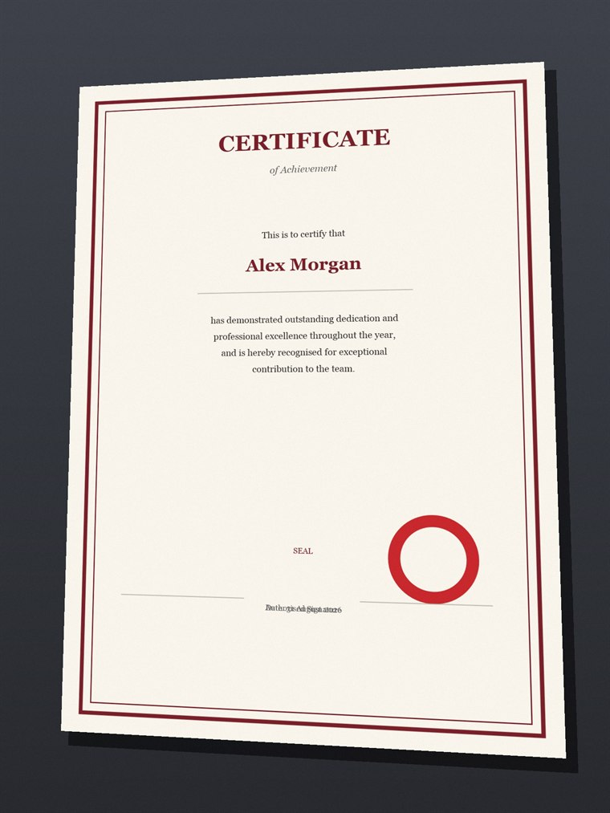
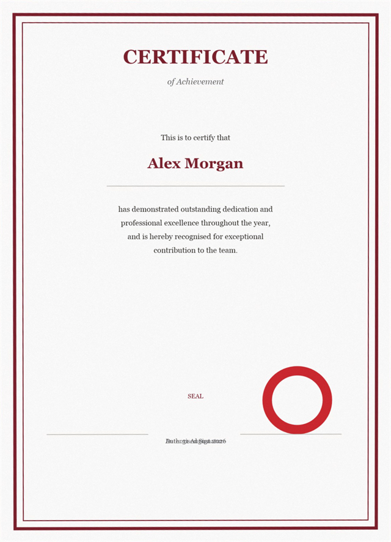

<div align="center">

# PaperScan

**把手机拍的文档照片，变成正经的扫描件。**

自动找纸面 · 透视矫正 · 白平衡 · 裁掉背景
按原始分辨率输出无损 PNG · 全离线 · 跨平台

[English](README.md) · [简体中文](README.zh-CN.md)

</div>

---

| 处理前 —— 照片 | 处理后 —— 扫描件 |
|---|---|
|  |  |

两张图都是合成的，由测试夹具重新生成。照片带透视倾斜、暖色偏色、投影和传感器噪点；
扫描件是 `paperscan` **不加任何参数**直接跑出来的结果。

## 两种用法

| | |
|---|---|
| **[直接在网页里用](https://paperscan.pages.dev)** | 什么都不用装。把照片拖到页面上就出扫描件，手机上可以直接拍。照片的**解码、矫正、编码全部在你自己的设备上完成** —— 没有服务器，不会上传，首次打开后离线也能用。框得不准可以直接拖动四个角，方向不对从四张缩略图里挑一张。 |
| **[安装命令行版](#安装)** | 同一套算法，可脚本化、可批量，按原始分辨率输出无损 PNG。适合一次处理五十张的情况。 |

两者共用同一条五阶段流水线和同一个回归基准；为什么会有两份实现，见
[`web/README.md`](web/README.md)。

> 上面的网址是占位符 —— 部署方法见[部署网页版](#部署网页版)。

## 它做什么

- **自己找纸面。** 不用你选框、不用点四角。它把照片阈值化成「够亮 + 偏暖」的像素，
  再从连通区里读出纸面四角 —— 包括**带闭合印刷边框**的证书（那种边框会把纸面切成
  外环和内部两块，把「取最大亮块」的朴素做法直接带沟里）。
- **透视矫正。** 用单应矩阵把纸面四边形映射成矩形。输出尺寸直接取自纸面自身的边长，
  所以是**原图分辨率下的 1:1 重采样**，不放大、不缩水。
- **白平衡。** 取每个通道的 90 百分位当作「纸白」拉伸到 250。室内黄光偏色被拉回中性，
  而红章、彩色 logo 的色相不会被改掉。
- **裁掉背景。** 从四条边向内探针，找到纸面真正的起点再裁切。成品**既没有黑边也没有白边**。
- **输出无损 PNG。** 24 位 RGB，不带 alpha，不做 JPEG 二次编码，除了检测用的缩略图之外
  没有任何降采样。

## 安装

### 直接下 Release

到 [Releases](https://github.com/YangRainmorning/PaperScan/releases) 下载对应平台的压缩包，
解压后直接运行 `paperscan`。自包含版本**不需要安装 .NET**。

### 用 .NET 工具安装

```bash
dotnet tool install --global PaperScan.Cli
```

### 从源码构建

```bash
git clone https://github.com/YangRainmorning/PaperScan.git
cd PaperScan
./scripts/build.ps1 -Publish -SelfContained
```

产物：

- Windows：`dist\paperscan.exe`
- Linux / macOS：`dist/paperscan`

### Windows 拖拽

构建好之后，把任意数量的照片**直接拖到** `scripts/paperscan.cmd` 上即可。
如果还没有构建过，它会先自动构建一次。

## 用法

```bash
paperscan photo.jpg
```

就这些。照片旁边会生成三个文件：

```
photo-scan.png      成品
photo-verify.png    自动检测到的四角叠加在原图缩略图上，用来核对
photo-preview.png   缩略图，方便快速预览
```

也支持批量：

```bash
paperscan *.jpg --quiet
```

### 参数

| 参数 | 默认 | 说明 |
|---|---|---|
| `-o, --out <文件>` | `<照片>-scan.png` | 输出路径，仅在只有一张输入时可用 |
| `-c, --corners <四角>` | 自动检测 | 手动指定四角，格式 `x,y;x,y;x,y;x,y`，顺序为**可读方向的** 左上;右上;右下;左下 |
| `-r, --reading-edge <边>` | `top` | 页面可读的「上」朝向照片哪条边：`top`、`right`、`bottom`、`left` |
| `-m, --margin <比例>` | `0` | 四周留白，占页面尺寸的比例 |
| `--no-trim` | 关 | 保留未裁切的矫正画布 |
| `--no-verify` | 关 | 不输出四角校验图 |
| `--no-preview` | 关 | 不输出预览图 |
| `--preview-width <像素>` | `1600` | 预览图宽度 |
| `--detect-long-edge <像素>` | `1024` | 检测用缩略图长边 |
| `--png <档位>` | `fast` | PNG 压缩档位：`fast`、`balanced`、`small` |
| `-l, --lang <语言>` | `auto` | 界面语言：`auto`、`en`、`zh` |
| `-q, --quiet` | 关 | 只输出错误 |
| `-h, --help` | | 显示帮助 |
| `-V, --version` | | 显示版本 |

| 退出码 | 含义 |
|---|---|
| `0` | 成功 |
| `1` | 至少一张图片处理失败 |
| `2` | 参数错误 |

## 四角不对怎么办

**证书横躺在照片里**（文字要歪头看才正）。照片竖构图、证书横躺 → 可读的「上」对应
照片的**右边**：

```bash
paperscan photo.jpg --reading-edge right
```

（照片倒着拍用 `bottom`，另一边躺用 `left`）

**自动检测没贴合。** 打开 `photo-verify.png`，绿框就是检测结果。没贴合就在图片编辑器里
读出原图四个角的像素坐标，手动传进去：

```bash
paperscan photo.jpg --reading-edge right \
  --corners "5834,456;5789,7975;489,7975;424,520"
```

顺序**永远是可读方向**的 左上 → 右上 → 右下 → 左下。

**想要白边**：`--margin 0.03`（每边加页面尺寸的 3%）。

## 处理流程

1. **找四角** —— 缩到长边 1024 的缩略图，标出「够亮 + 偏暖」的像素，聚成连通区，
   以**包围盒最大**的那块为种子，合并所有与它重叠的块，再按 `x+y` / `x−y` 的极值取四角。
2. **透视矫正** —— 解 8 元线性方程组得到「单位正方形 → 纸面四边形」的单应矩阵，
   然后遍历输出画布，对每个像素反算回源图坐标做双线性采样。
3. **白平衡** —— 在画布上统计各通道直方图，取 90 百分位当纸白，把每个通道归一化到 250。
4. **成帧** —— 把纸面多边形画在白底上，让四边形边缘被干净切掉（`--margin` 就来自这一步）。
5. **裁边** —— 每条边打 120 条探针向内找纸面起点，用第二个采样点确认，取最深的结果裁切。

细节和各参数取值的理由见 [`docs/algorithm.md`](docs/algorithm.md)。

## 性能

在一张 6144×8192（5000 万像素）的证书照片上实测，输出 7450×5290 PNG：

| 阶段 | 耗时 |
|---|---|
| 解码 | 0.6 秒 |
| 透视 + 白平衡 | 0.3 秒 |
| 找四角 | < 0.1 秒 |
| 裁边 | 0.1 秒 |
| PNG 编码（`--png fast`） | 7 秒 |
| **合计** | **约 10 秒** |

矫正和白平衡循环按行并行。结果是**逐比特等同于串行运行**的，因为每个像素的计算互相独立、
直方图累加用的是整数。

`--png balanced` 用大约 30 秒换约 10% 的体积收益。默认是 `fast`。

## 已知限制

- **闭合印刷边框以前会让检测失效，现在不会了。** 如果文档的边框、大 logo 或复杂装饰仍然
  被误判，请用 `--corners` 手动指定。
- **四个角必须都拍进画面。** 被裁掉的角找不回来。
- **光线要尽量均匀。** 强烈的单侧阴影会让检测偏内，这时用手动 `--corners`。
- **原图质量就是上限。** 工具只在相机给出的像素上运算，本身不引入损失，但也变不出原图
  没有的细节。
- **输出文件很大。** 4000 万像素、大部分是白纸的扫描件约 50–55 MB PNG。这是保留全部原始
  像素的代价；要小体积请自行转 JPEG。
- **不处理手写和印章。** 不去噪点、不去阴影、不做 OCR。它是矫正器，不是文档修复工具。

## 开发

需要 .NET 8 SDK（更新的也行 —— 项目目标是 `net8.0` 且设置了 `RollForward=LatestMajor`）；
网页版还需要 Node 24。

```bash
dotnet test                          # 44 个测试
./scripts/build.ps1                  # 还原 + 构建 + 测试
./scripts/build.ps1 -Publish -SelfContained
./scripts/build.ps1 -Publish -Runtime linux-x64 -OutputDirectory dist/linux

cd web
npm ci && npm test && npm run build  # 45 个测试，然后在 web/dist 产出 ~34 KB 的站点
npm run dev                          # http://localhost:5173
```

仓库结构：

```
src/PaperScan.Core/     引擎 —— 检测、单应、矫正、裁边
src/PaperScan.Cli/      paperscan 命令行工具
tests/PaperScan.Tests/  xunit 测试，含合成照片的端到端用例
web/                    网页版 —— Core 的零依赖 TypeScript 移植
scripts/                构建脚本与拖拽启动器
legacy/                 移植来源的 v0 PowerShell 实现（已冻结）
docs/                   算法说明与 README 配图
```

`web/` 有自己的 [README](web/README.md)，讲了架构、与 C# 默认值的两处有意偏离，
以及浏览器路径是怎么做冒烟测试的。

见 [`CONTRIBUTING.md`](CONTRIBUTING.md)。

## 部署网页版

`web/dist` 就是一个纯静态目录，任何能托管文件的地方都行。文档默认推荐 Cloudflare
Pages，因为 `github.io` 在国内经常很慢甚至打不开：

1. Cloudflare 控制台 → **Compute** → **Workers & Pages** → **Create** → **Pages** →
   **Connect to Git**。（新版把入口收进了 Compute 底下；旧版侧边栏里直接就有 Workers & Pages。）
2. 选择这个仓库。
3. 根目录填 `web`，构建命令填 `npm ci && npm run build`，输出目录填 `dist`。
4. 环境变量 `NODE_VERSION` = `24`。
5. 部署。之后往 `main` 推送会自动重新部署。

部署完把本文件和 `README.md` 里的 `paperscan` 换成分配到的 `*.pages.dev` 域名。
`web/public/_headers` 会被原样采用，里面配了严格的 CSP 和带哈希资源的长期缓存。

想用 GitHub Pages 的话，把 `web/vite.config.ts` 里的 `base` 改成 `'/PaperScan/'`，
然后发布 `web/dist`。


## 关于遗留的参考实现

`legacy/` 里是最初那个单文件 PowerShell 工具。它已冻结 —— 不再修 bug、不再加功能 ——
但它在一台什么都没装的 Windows 上仍然能跑，而且 C# 移植版正是以它为基准验证的。
详见 [`legacy/README.md`](legacy/README.md)。

## 许可

MIT，见 [`LICENSE`](LICENSE)。

PaperScan 依赖 [SixLabors.ImageSharp](https://github.com/SixLabors/ImageSharp)，
其许可是 [Six Labors Split License](https://github.com/SixLabors/ImageSharp/blob/main/LICENSE)：
开源项目免费，商业用途可能需要向 Six Labors 购买授权。如果这对你有影响，本项目对图像库的
依赖只有「解码 + 编码」两处，替换成一个宽松许可的库是可控的改动。

网页版不受影响：它用的是浏览器自带的解码器和编码器，`web/src/core/` 里没有任何第三方依赖。
